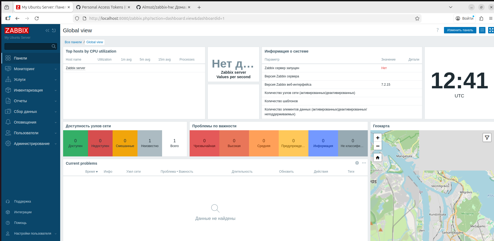

# Домашнее задание: Установка Zabbix Server
# Студент: Тугушев Данила Федорович

## Задание 1

Установлен Zabbix Server с веб-интерфейсом на Ubuntu 24.04.

### Скриншот авторизации в админке



### Использованные команды

```bash
# 1. Обновление системы и установка PostgreSQL
sudo apt update && sudo apt upgrade -y
sudo apt install postgresql postgresql-contrib -y

# 2. Добавление репозитория Zabbix 7.2
wget https://repo.zabbix.com/zabbix/7.2/release/ubuntu/pool/main/z/zabbix-release/zabbix-release_latest_7.2+ubuntu24.04_all.deb
sudo dpkg -i zabbix-release_latest_7.2+ubuntu24.04_all.deb
sudo apt update

# 3. Установка Zabbix Server
sudo apt install zabbix-server-pgsql zabbix-frontend-php php8.3-pgsql zabbix-nginx-conf zabbix-sql-scripts zabbix-agent -y

# 4. Создание базы данных
sudo -u postgres createuser --pwprompt zabbix
sudo -u postgres createdb -O zabbix zabbix

# 5. Импорт схемы
sudo zcat /usr/share/zabbix/sql-scripts/postgresql/server.sql.gz | sudo -u zabbix psql zabbix

# 6. Настройка пароля в конфиге
sudo sed -i 's/# DBPassword=/DBPassword=ВАШ_ПАРОЛЬ/' /etc/zabbix/zabbix_server.conf

# 7. Настройка Nginx (порт 8080)
sudo tee /etc/nginx/conf.d/zabbix.conf << 'EOF'
server {
    listen 8080;
    listen [::]:8080;
    root /usr/share/zabbix/ui;
    index index.php;
    location ~ \.php$ {
        include fastcgi_params;
        fastcgi_pass unix:/var/run/php/php8.3-fpm.sock;
        fastcgi_param SCRIPT_FILENAME $document_root$fastcgi_script_name;
    }
}
EOF

# 8. Настройка PHP
sudo sed -i 's/post_max_size = 8M/post_max_size = 16M/' /etc/php/8.3/fpm/php.ini
sudo sed -i 's/max_execution_time = 30/max_execution_time = 300/' /etc/php/8.3/fpm/php.ini
sudo sed -i 's/max_input_time = 60/max_input_time = 300/' /etc/php/8.3/fpm/php.ini

# 9. Запуск служб
sudo systemctl restart php8.3-fpm nginx zabbix-server zabbix-agent
sudo systemctl enable zabbix-server zabbix-agent nginx php8.3-fpm
